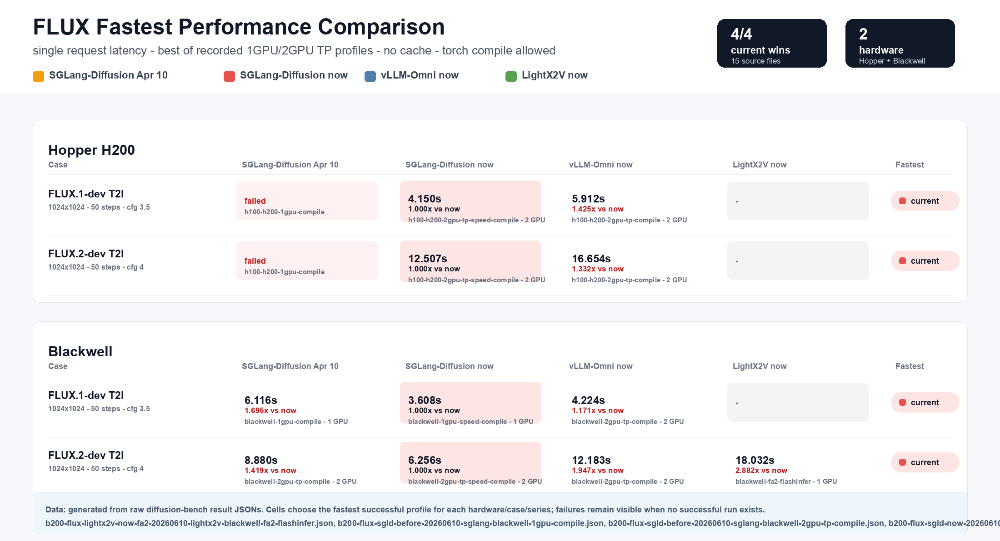

# FLUX Fastest Benchmark 2026-06-10

Scope: single-request latency, client-side timing, no response cache or Cache-DiT, torch compile allowed for fastest profiles. Each cell uses the fastest successful recorded 1GPU or 2GPU TP profile for that framework series on the same hardware.



## Versions

| Framework | Version |
| --- | --- |
| SGLang-Diffusion Apr 10 | `8227187d472da41a9c56ab6a0d1ba11efc574dd5` |
| SGLang-Diffusion now | `165331a2004fbda1531091341ed081d6a39d2162` |
| SGLang-Diffusion TP fix | `796a6080518041c671c4bef347a2d46f314f2f90` (`e25f72d8bbfab7039e2ec9ccbc38d33a88b329ad` measured; final head differs only by a comment amend) |
| vLLM-Omni now | `vllm==0.22.0`, `vllm-omni@73df8326d76fe3bba0b7b5a6abf6ad68976f24e8` |
| LightX2V now | `LightX2V@3db87106bafd980f0eeaffdb0d61dd26b364290c`, FA2 on Blackwell |

## Hopper H200

| Case | SGLang-Diffusion Apr 10 | SGLang-Diffusion now | vLLM-Omni now | LightX2V now | Fastest |
| --- | ---: | ---: | ---: | ---: | --- |
| FLUX.1-dev T2I | env failed | 4.150s, server 4.005s, 2GPU TP fix | 5.912s, 2GPU | not run | SGLang-Diffusion TP fix |
| FLUX.2-dev T2I | env failed | 12.507s, server 12.409s, 2GPU | 16.654s, 2GPU | not run | SGLang-Diffusion now |

## Blackwell B200

| Case | SGLang-Diffusion Apr 10 | SGLang-Diffusion now | vLLM-Omni now | LightX2V now | Fastest |
| --- | ---: | ---: | ---: | ---: | --- |
| FLUX.1-dev T2I | 6.116s, server 3.588s, 1GPU | 3.608s, server 3.242s, 1GPU | 4.224s, 2GPU | not run | SGLang-Diffusion now |
| FLUX.2-dev T2I | 8.880s, server 7.109s, 2GPU | 6.256s, server 6.150s, 2GPU | 12.183s, 2GPU | 18.032s, 1GPU | SGLang-Diffusion now |

## Reproduce

Run on devboxes, not CI or runner machines. Each external framework uses its own persistent venv under `/scratch/framework-venvs`; reinstall only when the pinned version or health check changes.

```bash
export SGLANG_DIFFUSION_FRAMEWORK_VENV_ROOT=/scratch/framework-venvs
export SGLANG_DIFFUSION_PIP_TMPDIR=/scratch/pip-tmp
export REPORT_DIR=/scratch/flux_fastest_20260610/report/raw
export DIFFUSION_BENCH_DISABLE_TORCH_COMPILE=0

HARDWARE_PROFILE=b200 RUN_ID_ROOT=b200-flux-sgld-now-20260610 FRAMEWORKS=sglang SGLANG_PROFILES="blackwell-1gpu-speed-compile blackwell-2gpu-tp-speed-compile" scripts/run_flux_fastest_20260610.sh
HARDWARE_PROFILE=b200 RUN_ID_ROOT=b200-flux-vllm-now-flashinfer-20260610 FRAMEWORKS=vllm-omni VLLM_OMNI_PROFILES="blackwell-1gpu-compile blackwell-2gpu-tp-compile" scripts/run_flux_fastest_20260610.sh
HARDWARE_PROFILE=b200 RUN_ID_ROOT=b200-flux-lightx2v-now-fa2-20260610 FRAMEWORKS=lightx2v LIGHTX2V_PROFILES="blackwell-fa2-flashinfer" scripts/run_flux_fastest_20260610.sh

HARDWARE_PROFILE=h200 RUN_ID_ROOT=h200-flux-sgld-now-xet-20260610 FRAMEWORKS=sglang SGLANG_PROFILES="h100-h200-1gpu-speed-compile h100-h200-2gpu-tp-speed-compile" scripts/run_flux_fastest_20260610.sh
HARDWARE_PROFILE=h200 RUN_ID_ROOT=h200-flux1-sgld-tpfix-native-20260611 FRAMEWORKS=sglang SGLANG_PROFILES="h100-h200-1gpu-speed-compile h100-h200-2gpu-tp-speed-compile" CASE_IDS=flux1_dev_t2i_1024 REPORT_DIR=/scratch/flux1_tp_shard_20260611/report/raw PORT_BASE=31680 scripts/run_flux_fastest_20260610.sh
HARDWARE_PROFILE=h200 RUN_ID_ROOT=h200-flux-vllm-now-20260610 FRAMEWORKS=vllm-omni VLLM_OMNI_PROFILES="h100-h200-1gpu-compile h100-h200-2gpu-tp-compile" scripts/run_flux_fastest_20260610.sh
```

Regenerate the image:

```bash
PYTHONPATH=src .venv/bin/python -m diffusion_bench.generate_flux_regression_image \
  --results reports/flux-fastest-20260610/raw/*.json reports/flux-fastest-20260610/failures/*.json \
  --output-png reports/flux-fastest-20260610/images/flux-fastest-hopper-blackwell-20260610.png \
  --output-svg reports/flux-fastest-20260610/images/flux-fastest-hopper-blackwell-20260610.svg
```

Known failure: the old H200 SGLang-Diffusion run failed before health check because the environment had `flashinfer-python==0.6.7.post3` and `flashinfer-cubin==0.6.7.post3`, but `flashinfer-jit-cache==0.6.11.post1+cu130`. The failure JSONs are kept in `failures/` and are not counted as latency data.
